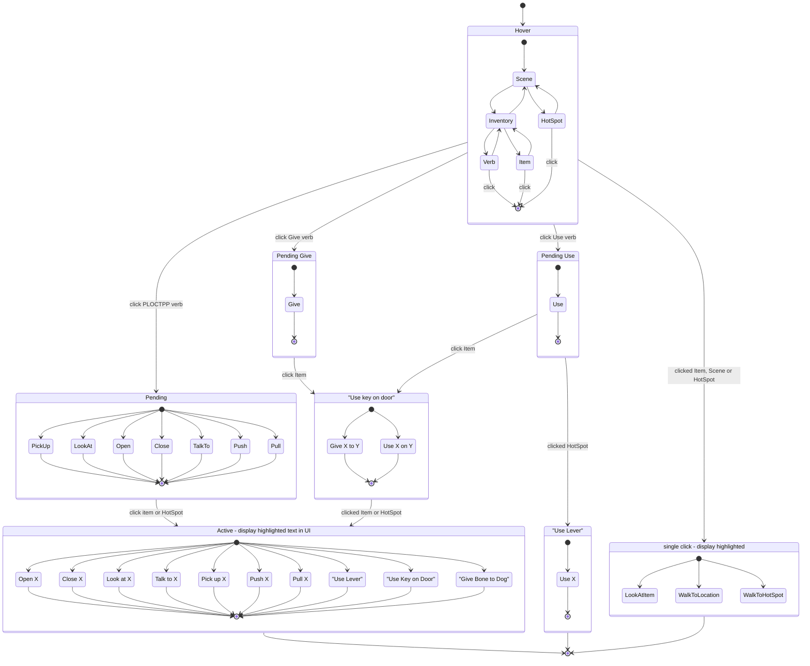

# Adventure Game 9-Verb FSM

The set of classes in `Source/AdventureGame/PlayerCommands` implements a Finite State Machine
to model the 9-Verb system of classic Lucas Arts adventure games.

State Chart / HSM - [Mermaid Editor]

[Mermaid Editor]: https://mermaid.live/edit#pako:eNqNVm1v2jAQ_iuWpX6ZoKKjpK0_TMqoNNDQQCps7cY-ZMQLEYkdJQaVIf77_JI340s3pKrxcy--89099glveEgxwYUIBH2MgygP0v7h_Zoh-fvx7ifq9z-gCT_Q3EBazwDoZKC25tOGMtrAeqkFU3agTPD82Ahr6G3LCRdPGReNqAQgK9vlVNC0S_aV5r8amVp1him9dMlqO5U_QZsk3uwAS1DaTsNROK-Z-TAnrXQWlIUxiyo9tJjNx8vFAh3qTK6u0JcgpeGYpxkvYkEJ8hkXW-mghtpVrDwCdVzIHVaZi8843_nCxecZZS46TnhBXXgZJLslBzbdF1sITZIGNYFVh9bgJjAXV4G5qA7MhU1gLq4Cg9AksdHuqn2KD7QqnPpuVc3SqEqiVkCptClUrkZfuzTOAPB_410Vdbjy041Wy6tgVwUUq7KDQl21W2KhHTlQR5jVhkrqb4TKp4oyVrPGc5stjA6pdPsojIssCY5oG0fbRP4JGiJBXwWKGVpN20mUJkACvt3reklMnz0D2hczYNak7EDI4HLESoDoFkeBAI0uR6oEiG5pJDhodDnkJUD0kKF9BhtZQ6qXxAwIrN0eXr0kZnAgbasPfN0aa6zaYUbVBYQBE7vHfdP4a6x7_SOXV4jM_ZFHoK30PGf2hnNWbfmZHhFn0pZbG_swofgdjOJ38ZLfxTV-F8P5MAv5Lg1VycDoHAr_DW5ojbMh7zyiQgLV5Jlb1uGyfyubQatVoFlb2uVdNryGnlVlXwATq4mWFb9IfVnNlwtfwBXgsg8y_1u5mA7ZmQ4Jyw4Bk-ogwYkV5KQJ0gadilhxQPPxdskUUFZCEp9Flc0NMGUyByZsfpXqqnS98l12SbQma9vy1PV6sJ9lleybnocZ3wQi5qxLbu1aHoi1LUGFTDShZb-BlF8dU9N6zYVi5-skah2lVR07eUtkY7iHozwOMfkdJAXt4ZTmaaDWWJ_YGssHW0rXWNU2DPKdKutZGmUB-855ionI99Is5_toWzvZZ2Hzfq9VZBvQfMz3TGByNxpoH5ic8CsmNw_etfcwuh89jAaeN_TuvB4-YjK8vx4Nvdvhzd1o5A2k-Pbcw3_0toPre-mj9bs5_wU-YG1Z

Update this link after editing in the Mermaid Live Editor by using the `Share > Mermaid Live` button in the editor to get the encoded link above.

# Parts of the UI

* The Interaction UI (above the 9-verbs and item buttons)

This is where commands are displayed in text form eg _Look at Pickle_. If the command is **dimmed** (as in the screenshot) then it is **pending**. The player has hovered a target for the look at command, but not clicked. Once clicked, the command is high-lighted in bright text and is **active**. If the game engine has to animate the action then it could stay highlighted for a time. For _LookAt_ the bark text will display above the player character's head, but then the action will quickly finish.

1. Verb button
2. Inventory - these slots are empty. For the FSM "Inventory" refers to the whole UI outside of the scene, that is the bottom portion of the screen in black.
3. Item - the pickle has been picked up and added to the inventory. Note that a pickle on the ground, in the scene is _not an item_, it is a **hotspot**.
4. Scene - the game play area. Players can click anywhere here to have the player instantly walk there. Some parts of the scene are inactive (no nav-mesh) and so nothing will happen, but still count as "scene".
5. Hotspot - interactable item in the scene. Its not possible to hover the hotspot without "hovering the scene" first (even though clicking in the scene outside the poster doesn't work). 

# Player Commands

Note - this screenshot is possibly out of date. Its provided in case where ever these docs are viewed does not have a mermaid render environment.

It should be obvious via the FSM what the legal actions are. Here is a non-exhaustive list, and how they would be activated, and what would display on the UI.

## Walk to a location

|   Player UX steps               |  Interaction UI display   |
| ------------------------------- | ------------------------- |
| Hover the scene                 | Walk to                   |
| Click a location                | **Walk to location**      |

In game, if the location is a navigable area the player character will animate and walk there. The FSM transitions from `Hover::Scene` -> `InstantActive::WalkToLocation`

The Interaction UI panel will display: `Walk to location` in bright text after the click.

## Use Pickle on Poster

|   Player UX steps               |  Interaction UI display   |
| ------------------------------- | ------------------------- |
| Hover then click the `Use` verb | Use                       |
| Hover the pickle item           | Use pickle                |
| Click the pickle item           | Use pickle on             |
| Hover the poster hotspot        | Use pickle on poster      |
| Click the poster hotspot        | **Use pickle on poster**  |

In game, if the location is a navigable area the player character will animate and walk there. The FSM transitions from `Hover::Scene` -> `InstantActive::WalkToLocation`

The Interaction UI panel will display: **Use pickle on poster** in bright text only at the end after clicking the poster. Before that in the targeting step where the poster is hovered _Use pickle on poster_ is displayed in dimmed text.

# UI Limitations - Using Items

The UX is very powerful, despite its retro style. One limitation is that you cannot simply "Use" an item from the inventory. You can "Use" a hotspot, which could be a lantern sitting on the ground.

An item in the inventory has to be used on something in the scene.

If for example there was a dark room and the player had a lantern in their inventory, it would need to be used on something in the scene. Alternatively you could have a match in the inventory as well, 
then "Use match on lantern" and once it was lit in the inventory, display a lit lantern, and at the same time light the room.