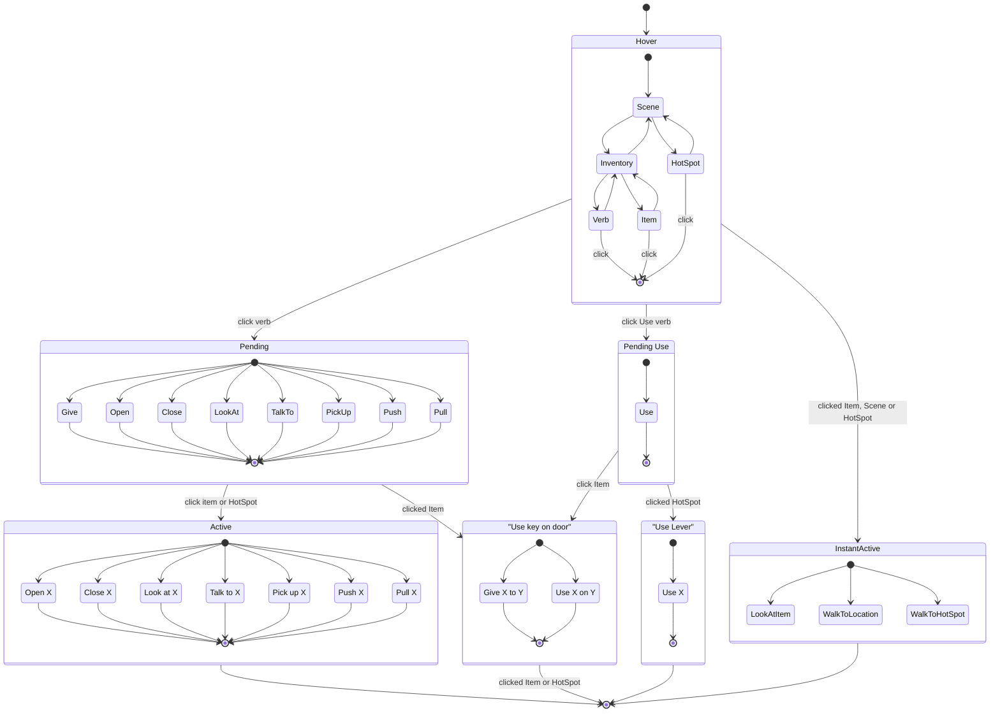

# Adventure Game 9-Verb FSM

The set of classes in `Source/AdventureGame/PlayerCommands` implements a Finite State Machine
to model the 9-Verb system of classic Lucas Arts adventure games.

State Chart / HSM - [Mermaid Editor]

[Mermaid Editor]: https://mermaid.live/edit#pako:eNqVVtuO2jAQ_ZXI0r5UgHaBbMAPlSIqdZFQi7TQ0jZ9SBMXIhI7chzULeLf15fcHDtblReYMzPOjM-ZIVcQkRgBCAoWMvQhCY80zMaXaYAd_vnx7qczHr93nsgFUQXJOAU4VwV1I58jhFELS1M61viCMCP0pXU20NuZT4Q954S1rgqwZelHrhnKhnxfEP3V-oQ1WCY_ZcjX5In-oROlSXS2ZFq93TaMgFuA1Q910yJmi3Cc4GMd51yaDu7unE9hhuIVyXJSJAxBx8eEnXhiA3XZq0-y8PcxuSAT_ZwjbKKrlBSW4A0hZ5-Z-C5Mzzti4lvezD634GVxsqFp2qKi3PoCW1SUa6KyXBNW5Zq4KtfEVbkWnJdrQ9NUR4eZ3Reo5pb_7PDb9dfc7QsbpSLPwup23yVqKw8yoIEy6wcKrx8xceF1lYnQN6H6hP6vGKszLVX7uuykCRW5B0t0T47KhhXttoS-UCsASkk4IbMm9VVcAVDqxWHEmtSXeAVAKSanzO1Jmv6lCZXK7NHduZAmVOo79K7QFKk_MBr-0Gz4Q8PhD02Hbx8P_4356EharQ96RIwDtfrUdjdF2gTWOkVx559Aia6Nsehupy9BaUK1ag6C4W-WFG2advWA8XiCu_E7-8LamePnqO9O1wEQUWf0Is6MCaEBqNvvNTWwBXytSL8tUgcNOrQ6ZJYqZYPEWwH4F18CaJnQdkW7AteY94CZvmAq4kbVy0B_06iu9czr0P-R_i5Q-75KHW9IFLKE4CG_9tRGn62GqgvTqzbK1S5Eu2O9Bc2lY2AEjjSJAfwdpgUagQzRLBQ2kH0HgK_ZDAVAMBSH9CzIufGkPMTfCckAZLTkaZSUx1NzSJnH7atfE8LJRHRFSswAfPBm8gwAr-CPNCdzd-Yuvbk7f5x67mIEXgCcuZPZ1Fs-TO8Xi9l84S0fbyPwVz72frLw3Nsr34Pn7w

Update this link after editing in the Mermaid Live Editor by using the Share > Mermaid Live button in the editor to get the encoded link above.