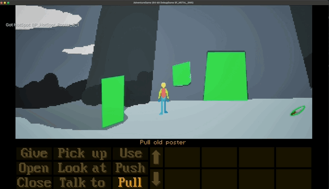

# Screen and Camera Calculations.



* The game is out-of-the-box set up for a native resolution of 320 x 200
    * This is 16:10 
        * The old Lucas Arts games were this resolution
        * For example [Monkey Island](https://en.wikipedia.org/wiki/The_Secret_of_Monkey_Island)
    * which is not as wide as say a iPhone 8+ at 16:9
        * That iPhone native resolution is `1472w x 828h @ 2x`
        * Popular resolutions today are: 720p / HD 720 - 16:9 - 1280w x 720h

This How-To details the calculations and thinking necessary to customize the camera and 
other values hard-coded into the Adventure game for other screen dimensions.

To set things up as per the 320w x 200h target resolution you need to make settings as folows:

## Camera Confines - Follow Camera
* Camera Box Extents - Height & Width is max height & width of Environment Art at game scale.
    * See below for full analysis of this
        * `x: 240 - y: 72.5 - z: 10`
    * Box Extent == 1/2 of game art tower background
        * The values above come from the tower artwork 
        * It is `480w x 145h` - fits inside the UI game area vertically
        * horizontally it accommodates the game art which is 481 pixels wide.


* Spring Arm 
    * Rotation - X: 0, Y: -90, Z: -90
    * Target Arm length 200
    * Use Pawn Control Rotation - No 


If you open the viewport tab on the follow camera blueprint you can see the camera is 200 units
above the view target. This is done with the **Spring Arm** as above.

This is not done with a transform on the camera. Make sure the camera
transforms are all zero. You can set the scale to a small value to make the editor mesh less 
intrusive.

* Camera Settings
    * Projection Mode > Orthographic
    * Ortho width: 320
    * Auto calculate ortho planes: ☑️
    * Aspect ratio: 2.206897 - can get this by typing in `320 / 145` and pressing enter
        * These are the dimensions of the game area - let Unreal calculate this for you.
        * Note this field only appears after constrain aspect ratio is set below
        * this will make black bars if the game is played on a device that is other than 320 x 200 - 1.6


* Camera Options
    * Constrain aspect ratio: ☑️


## The HUD Screen

Check the sizes of the main area match what your game viewport dimensions are.

* In the Lesser Dog tut out-of-the-box values this 320w x 200h
    * Game area: 320 x 145
    * UI area: 320 x 55

# Calculate Values for a Game
Step by step, the process to customise the adventure game code and assets for a given game is:

1. Choose a target resolution for play. Call this **W x H** eg
    * For example - 16:9 - HD 720p - W = 1280 x H = 720
2. Assume that it will play:
    * without black bars when run at this resolution, and 
    * with black bars at other resolutions
    * see bars in the gif above which is at 16:9, a slightly wider screen than 16:10
3. Calculate and set the values for the UI Area, **UW x UH**:
    * This is 320 x 55 scaled to the screen width, so:
    * UI: UW = 1280, UH = 55/320 * 1280 = 220
    * Set the Size boxes in the main AdventureHud blueprint accordingly.
4. Calculate the Game area, **GW x GH**:
    * This is GH = H - UH = 500
    * GW = 1280 x GH = 500
5. Calculate the Camera Values:
    * Ortho width = GW = 1280
    * Aspect ratio = GW/GH = 2.56

## To Calculate the Per Level/Scene Camera Bounds
* The scene background art is **AW x AH** in size
    * AW x AH can be higher and wider than GH and GW, but must not be smaller
        * If AW is wider then the camera can pan left to right with the player.
        * If AH is higher then the camera can pan up and down with the player.
    * In Justin's supplied art he makes it actually 1 pixel bigger, eg 481 wide and 146 high
    * this is a fix for texture compression/GPU artefacts I think.
* Once the scene has been defined and background art done, you have AW x AH
* The box extents for the camera bounds box has to be set for each level:
    * `Y = 1/2 AH, X = 1/2 AW, Z = 10`
    * For example if art is 2184w x 1228h, extents are 1092 x 614
        * It is inside these extents that the camera (the black box) is constrained
        * Even if the character walks to the extreme left
            - the black box can only move so its left border is at the left side of the artwork


## Example Calculations
* For Justin's game its 
    * x: 240 - y: 72.5 - z: 10 - Box Extent == 1/2 of game art tower background
* For a sample 16:9 game with 720p target screen res, W = 1280 and H = 720
* 481 x 146 pixels - tower exterior - scrolls left and right
* 320 x 146 pixels - tower interior - does not scroll

## Split Screen Layout
* We need to find SW and SH, the first two floats in the second line of code below:

```cpp
FSplitscreenData ScreenLayout;
auto Screen1 = FPerPlayerSplitscreenData(1, 0.725f, 0, 0);
ScreenLayout.PlayerData.Add(Screen1);
```

We can see the effect of various screen sizes by adjusting the Play-in-Editor screen size:

* Editor Preferences > Level Editor Play > Game Viewport Settings

Playing on a 16:9 display, for example an Apple iPhone 8+ with 1472w x 828h @ 2x - this split screen layout gives:

* 1472w x 600h > game area
* 1472w x 228h > UI area

SH is fixed at 1, which means to calculate that 0.725f figure we need to find what fraction of the height of the viewport is going to be used by the gamescreen, so SH = GH / H:

For the 16:9 - 720 HD case GW = 1280, GH = 500; and H = 720. So SH = 500/720 = 0.69444444.

```cpp
FSplitscreenData ScreenLayout;
auto Screen1 = FPerPlayerSplitscreenData(1, 0.69444444f, 0, 0);
ScreenLayout.PlayerData.Add(Screen1);
```