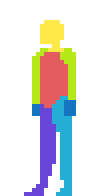

# Adventure Game in Unreal Engine

This is my work from following the excellent Lesser Dog [Point and Click 2D Adventure Game tutorial](https://www.youtube.com/watch?v=sEy3c5JcLys&t=7s) on Youtube.

My Dev Environment:

* Mac M3
* Rider
* Unreal 5.5

~~Out of Date Screenshot~~

* Screenshot of state at end of Episode 1.
* The black area at the bottom will have Lucas Arts style text

**Update**

I have moved to using a [character sprite sheet](https://danger-goose.itch.io/point-and-click-adventure-game-sprite-template) from _Danger Goose_ on itch.io.

I've also implemented the whole thing in C++ pretty much. There's a lot of per-item
customisations that make sense to stay in Blueprint, but the C++ implementation makes
it a lot more manageable. As of right now, actions are working, moving from room to
room, as at Chapter 5 but with maybe some minor niggles.

## Math Nodes

* Most of the tutorial went as per Lesser Dogs excellent guidance.
* In Unreal 5 you need to use the `-` and `+` nodes which are generic per type
* The `AddFloat` or whatever typed nodes are not available in UE5 by default
* although you can return to them via a config

* Screenshot of the `BP_AdventureCam` blueprint `GetCameraConfines` function
* The `-` and `+` nodes are at the right of the screenshot

## Nav Mesh Problems

* I had a lot of problems with generating and having my nav mesh show up
* This comment from [@sentinel2952](https://www.youtube.com/@sentinel2592) helped me track down the solution:

> If you are in ue5 (I'm in 5.4) and having trouble generating the navmesh from the brush at the end, 
> you can save the brush as a static mesh, then open the new static mesh asset and generate collisions 
> and then set the collision complexity to "use complex as simple".

* Activate brush-editing mode - use Return or Enter to close the shape.
* Do not add a Nav bounds volume at this time

* Select the brush in the hierarchy / scene outliner and in the detail panel click _Create Static Mesh_

* Locate the mesh you created in the previous step, double-click to open in a new editor tab
* Select _Auto Convex Collision_ from the Collision menu to generate a collision mesh

* Change this drop-down in the details panel in the static mesh editor tab to _Use Complex Collision as Simple_

* After this go back to the main editor window, and add the Nav Bounds volume, and continue as per Lesser Dogs instructions

## Player Character Falling

At the end of the first episode on running the project with the player character it fell constantly. In 
my case the fix for this is:

* change from top to side view (eg "right") 
* make sure the character mesh is above the red line of the background image
* make sure the character is inside the nav mesh bounds

# Customisations 

I wanted to change to using Enhanced Input so that I could more easilty switch to mobile, and also
to use C++ for the bulk of the logic as the blueprints are very complex and hard to follow in the Lesser Dog tutorial. See the source code here:

* [AdventureCharacter.cpp](Source/AdventureGame/AdventureCharacter.cpp)

...and the how to for Inputs here: 

* [Inputs How to](../Docs/HowTo.md#create-inputs)

Also I wanted to have animation states handled using Paper ZD.  See the doc here for this.

* [Paper ZD animation states](Docs/AnimationStateMachine.md)

I have moved to using a [character sprite sheet](https://danger-goose.itch.io/point-and-click-adventure-game-sprite-template) from _Danger Goose_ on itch.io. Its intended 
to be a template that you can then overwrite with your own character art.

