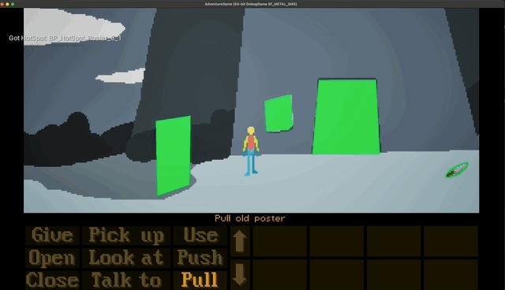

# Adventure Game in Unreal Engine

My Dev Environment:

* Mac M3
* Rider
* Unreal 5.5

* Screenshot of state at end of Episode 5.

I implemented the main game logic in Unreal C++. At the present time I'm ready to move to using
the framework to make an original game, and I'm not following the tutorial from this point.

Surface level it looks very much the same as Lesser Dog's [Point and Click 2D Adventure Game tutorial](https://www.youtube.com/watch?v=sEy3c5JcLys&t=7s) on Youtube. See here for the changes:

* [Differences from Lesser Dog tut](./Docs/Differences.md)

# Learnings

* [PaperZD Animation State Machine](./Docs/AnimationStateMachine.md)
* [Managing the Commands](./Docs/CommandState.md)
* [Issues that I ran into](./Docs/Issues.md)
* [How to customise the screen resolution for other games](./Docs/ScreenAndCamera.md)
* [How to make this game from scratch](./Docs/)

## Fonts Update & Credit

* I'm using [Press Start 2 Play](https://www.zone38.net/font/) now
* [License text](./3rdParty/LICENSE.txt)

It's a full-unicode retro gaming font. As far as I can tell Cody is the original
author of this font, and its been resold many times on the internet by unethical persons.

## Sounds Credit

Door - Stone - Large - 001.wav by DWOBoyle -- https://freesound.org/s/474178/ -- License: Attribution 4.0

button 6.wav by bubaproducer -- https://freesound.org/s/107153/ -- License: Attribution 4.0

VS Button Click 04.mp3 by Vilkas_Sound -- https://freesound.org/s/707041/ -- License: Attribution 4.0

Looping Gentle Wind Ambience on an Open Desert Plain.wav by dhallcomposer -- https://freesound.org/s/697217/ -- License: Creative Commons 0

Button hover.wav by Fachii -- https://freesound.org/s/338229/ -- License: Creative Commons 0
